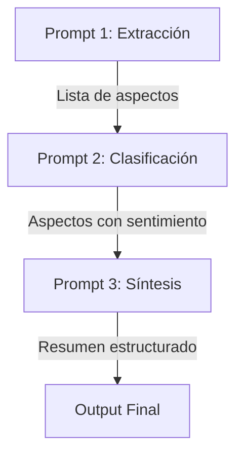

# Prompt Chaining (Encadenamiento de Prompts)

> Metodología para dividir tareas complejas en secuencias de prompts simples y especializados

## 📝 Definición

El **prompt chaining** o **encadenamiento de prompts** es una técnica avanzada de ingeniería de prompts que consiste en dividir una tarea compleja en una serie de pasos secuenciales, donde la salida de un prompt sirve como entrada para el siguiente.

### Concepto clave
Al igual que una cadena de montaje industrial descompone la fabricación en pasos especializados, el prompt chaining descompone problemas complejos en prompts simples e interconectados.

## 🔄 Metodología para Dividir Tareas Complejas

### Proceso de implementación

1. **Análisis de la tarea**: Identificar componentes y dependencias
   ```
   Tarea compleja → Subtareas independientes
   ```

2. **Diseño de cadena**: Definir secuencia lógica de prompts
   ```
   Subtarea A → Subtarea B → Subtarea C
   ```

3. **Interfaz entre prompts**: Formato estandarizado para transferencia
   ```
   Output A (estructurado) → Input B (esperado)
   ```

4. **Gestión de errores**: Mecanismos para manejar fallos en cada eslabón
   ```
   Verificación en cada paso → Retroalimentación o corrección
   ```

5. **Optimización**: Refinamiento iterativo de cada prompt
   ```
   Análisis de rendimiento → Mejoras específicas por paso
   ```

### Beneficios del enfoque

| Beneficio | Descripción |
|-----------|-------------|
| **Modularidad** | Facilita mantenimiento y mejoras individuales |
| **Especialización** | Cada prompt optimizado para una tarea específica |
| **Depuración** | Identificación precisa de problemas en la cadena |
| **Reutilización** | Componentes compartidos entre diferentes aplicaciones |
| **Escalabilidad** | Fácil extensión añadiendo nuevos eslabones |

## 💡 Ejemplos de Prompt Chains Efectivos

### 1. Análisis de Sentimiento en Reseñas de Productos



#### Implementación:

**Prompt 1: Extracción de aspectos**
```
Identifica todos los aspectos del producto mencionados en esta reseña:
"El teléfono tiene una batería excelente que dura todo el día, pero la cámara es mediocre en condiciones de poca luz."

Formato: Lista numerada de aspectos mencionados.
```

**Prompt 2: Clasificación de sentimiento**
```
Para cada aspecto de esta lista:
1. Batería
2. Cámara

Clasifica el sentimiento (positivo/negativo/neutral) basado en esta reseña:
"El teléfono tiene una batería excelente que dura todo el día, pero la cámara es mediocre en condiciones de poca luz."

Formato: Aspecto: sentimiento
```

**Prompt 3: Síntesis final**
```
Genera un resumen de opinión basado en estos aspectos clasificados:
- Batería: positivo
- Cámara: negativo

Formato: Párrafo conciso destacando puntos fuertes y débiles.
```

### 2. Desarrollo de Especificación de Software

```
Prompt 1: Requisitos → Extrae requisitos funcionales/no funcionales
↓ [Lista de requisitos]
Prompt 2: Validación → Verifica consistencia y completitud
↓ [Requisitos validados]
Prompt 3: Especificación → Transforma en historias de usuario detalladas
↓ [Historias de usuario]
Prompt 4: Estimación → Asigna complejidad/esfuerzo a cada historia
```

### 3. Generación de Contenido Educativo

```
Prompt 1: Estructura → Crea esquema de lección basado en objetivos
↓ [Esquema]
Prompt 2: Contenido → Desarrolla cada sección con explicaciones
↓ [Contenido detallado]
Prompt 3: Ejemplos → Genera ejemplos ilustrativos para conceptos
↓ [Contenido + ejemplos]
Prompt 4: Evaluación → Crea preguntas para verificar comprensión
```

## 🔄 Manejo de Contexto entre Prompts

### Técnicas de Transferencia de Contexto

#### 1. Paso Explícito de Información
- **Método**: Inclusión completa de output anterior
- **Ventajas**: Simple, transparente
- **Desventajas**: Consume tokens, puede incluir ruido
- **Ejemplo**: 
  ```
  Basándote en esta lista de requisitos: 
  [LISTA_COMPLETA], 
  genera historias de usuario
  ```

#### 2. Contexto Resumido
- **Método**: Condensar información relevante entre prompts
- **Ventajas**: Eficiente en tokens, enfocado
- **Desventajas**: Posible pérdida de detalles
- **Ejemplo**: 
  ```
  Del análisis anterior, los 3 temas principales son: 
  [TEMAS_RESUMIDOS]. 
  Profundiza en cada uno.
  ```

#### 3. Estado Persistente
- **Método**: Mantener variables de estado entre prompts
- **Ventajas**: Eficiencia, evolución natural
- **Desventajas**: Complejidad de implementación
- **Ejemplo**: Sistema de variables compartidas entre prompts

### Estrategias para Coherencia

#### 1. Prompts con Memoria
```
# Contexto Previo
[RESUMEN_INTERACCIONES_ANTERIORES]

# Estado Actual
[INFORMACIÓN_ACTUALIZADA]

# Nueva Tarea
Basándote en lo anterior, ahora debes [INSTRUCCIÓN]
```

#### 2. Tokens de Continuidad
- Identificadores específicos que conectan prompts relacionados
- Ejemplo: "Continuando TAREA-123: Ahora implementa la fase 2..."

#### 3. Verificación de Coherencia
- Prompt dedicado a revisar consistencia entre outputs
- Ejemplo: "Verifica que esta respuesta: [RESPUESTA] sea coherente con el contexto: [CONTEXTO]"

## 🛠️ Plantilla de Prompt Chain

```markdown
# Cadena de Prompts para: [OBJETIVO_GENERAL]

## Paso 1: [NOMBRE_PASO_1]
### Input:
[DESCRIPCIÓN_INPUT_INICIAL]

### Prompt:
"""
[INSTRUCCIÓN_DETALLADA]
"""

### Output esperado:
[FORMATO_Y_EJEMPLO]

## Paso 2: [NOMBRE_PASO_2]
### Input:
Output del Paso 1

### Prompt:
"""
Basándote en [REFERENCIA_PASO_ANTERIOR], ahora [NUEVA_INSTRUCCIÓN]
"""

### Output esperado:
[FORMATO_Y_EJEMPLO]

## Paso 3: [NOMBRE_PASO_3]
...

## Manejo de Errores:
- Si el Paso X falla: [ESTRATEGIA_RECUPERACIÓN]
- Verificación en Paso Y: [CRITERIOS_VALIDACIÓN]
```

## ⚠️ Consideraciones y Mejores Prácticas

### Desafíos comunes

1. **Pérdida de contexto**: Información importante que se pierde entre eslabones
   - **Solución**: Definir claramente qué información debe transferirse

2. **Propagación de errores**: Fallos tempranos que afectan toda la cadena
   - **Solución**: Validación en cada paso y mecanismos de recuperación

3. **Eficiencia de tokens**: Consumo excesivo al pasar contexto completo
   - **Solución**: Técnicas de resumen y selección de información relevante

4. **Complejidad de mantenimiento**: Dificultad para modificar cadenas largas
   - **Solución**: Documentación clara y diseño modular

### Cuándo usar prompt chaining

✅ **Casos ideales**:
- Tareas complejas con pasos bien definidos
- Procesos que requieren diferentes tipos de razonamiento
- Necesidad de puntos de verificación intermedios
- Reutilización de componentes en múltiples flujos

❌ **Casos no recomendados**:
- Tareas simples que pueden resolverse con un solo prompt
- Procesos altamente interdependientes difíciles de separar
- Cuando la eficiencia de tokens es crítica
- Interacciones que requieren fluidez conversacional

## 🚀 Aplicaciones Avanzadas

### Combinación con otras técnicas

#### Chain of Thought + Prompt Chaining
```
Paso 1: Razonamiento detallado sobre problema
↓
Paso 2: Extracción de conclusiones clave del razonamiento
↓
Paso 3: Aplicación de conclusiones a caso específico
```

#### RAG + Prompt Chaining
```
Paso 1: Búsqueda de información relevante
↓
Paso 2: Análisis y síntesis de fuentes recuperadas
↓
Paso 3: Generación de respuesta basada en síntesis
```

### Implementación en sistemas productivos

1. **Orquestación**: Frameworks como LangChain, AutoGen
2. **Monitoreo**: Seguimiento de éxito/fallo en cada paso
3. **Optimización**: Análisis de rendimiento por eslabón
4. **Versionado**: Control de cambios en cada prompt de la cadena